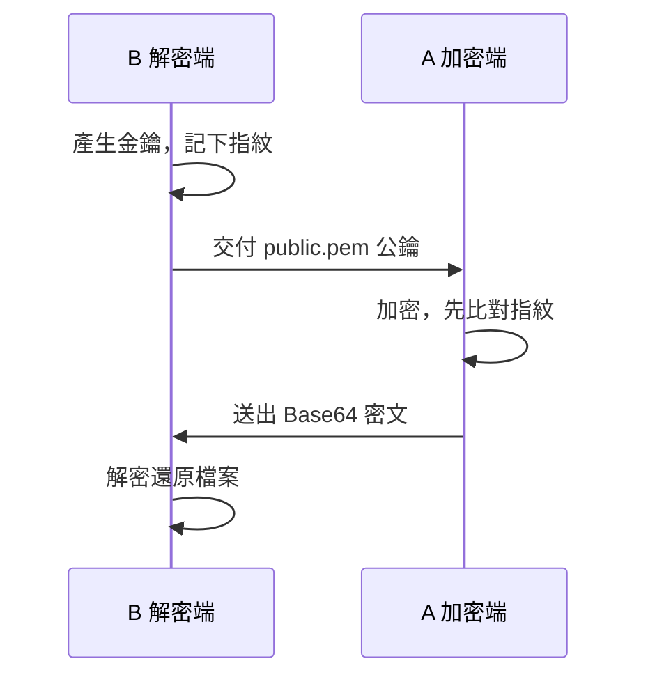

# runepost

把檔案加密成一段可以直接貼上的 Base64 純文字，經由公開管道送到自己的另一台機器，
在那裡用私鑰還原成原本的檔案樹。

本工具僅限 Windows + PowerShell 7.4+（`pwsh`），完整需求見下方〈環境需求〉。

## 快速使用

### 1. 安裝（從 Release 抓自足單檔）

```powershell
$dir = "$HOME\runepost"
New-Item -ItemType Directory -Force $dir | Out-Null
irm https://github.com/hunandy14/runepost/releases/latest/download/rune-seal.ps1 -OutFile $dir\rune-seal.ps1
irm https://github.com/hunandy14/runepost/releases/latest/download/rune-open.ps1 -OutFile $dir\rune-open.ps1
Get-ChildItem $dir\*.ps1 | Unblock-File   # 解除「從網路下載」的封鎖標記
```

### 2. 加入 PATH

把 `~\runepost` 加進使用者 PATH（免管理員權限），之後在任何位置都能呼叫：

```powershell
$p = [Environment]::GetEnvironmentVariable('Path', 'User')
if ($p -notlike "*$dir*") { [Environment]::SetEnvironmentVariable('Path', "$p;$dir", 'User') }
$env:Path += ";$dir"   # 目前這個視窗也立即生效
```

若腳本被執行政策擋下，執行一次 `Set-ExecutionPolicy -Scope CurrentUser RemoteSigned`。

### 3. 初始化金鑰

```powershell
rune-open.ps1 -GenerateKeys
```

私鑰寫到 `~\.rune\private.key`、公鑰寫到 `~\.rune\public.pem`，並印出**公鑰指紋**
（`Fingerprint  RUNE-KEY ...`）。記下這行，跨機器時用來核對。

### 4. 加密

```powershell
rune-seal.ps1 $HOME\runepost      # 檔案或資料夾都行——這裡拿剛裝好的資料夾當範例
```

產出 `runepost.txt`（以來源資料夾命名）——一段可直接貼上的 Base64；第一行會印出所用公鑰的指紋。

### 5. 解密

```powershell
rune-open.ps1 runepost.txt $env:TEMP\runepost-out
```

```
Decryption complete. Restored 2 files to: C:\Users\alice\AppData\Local\Temp\runepost-out.
```

還原的檔案在 `$env:TEMP\runepost-out`——剛才 `~\runepost` 底下的兩支 `.ps1` 都回來了，
資料夾的子目錄結構也會原樣保留。

### 跨機器使用

runepost 是**單向**傳送：金鑰對永遠在解密端（B）產生，私鑰不離開 B；加密端（A）只拿公鑰。



- **B** 跑第 1–3 步、**A** 跑第 1、2、4 步（A 第 2 步放的是 B 給的公鑰），密文傳回後 **B** 跑第 5 步。
- **公鑰不是祕密**：複製它走隨身碟、雲端、甚至和密文貼在同一個公開版面都行。
- **唯一必做的檢查**——A 每次加密都印出所用公鑰的指紋，**務必和 B 在第 3 步記下的那行逐字
  比對**。不一致代表 `public.pem` 被掉包；工具不會、也無法替你比對。

> 也可以用 `-PublicKey` 一次性指定公鑰檔或直接傳入 PEM 字串，不必先放到 `~\.rune\`。

### 驗證下載的單檔（選讀）

每個 Release 附了 `SHA256SUMS.txt`。擔心單檔在下載途中被動過手腳，第一次用前核對雜湊：

```powershell
Get-FileHash $HOME\runepost\rune-seal.ps1 -Algorithm SHA256
# 和 Release 頁面 SHA256SUMS.txt 裡 rune-seal.ps1 那行比對；同一版驗過一次就夠
```

這裡有**兩個各自獨立**的核對，別搞混：

| 驗什麼 | 用哪個 | 來源 |
|---|---|---|
| 工具是不是原版 | **檔案 SHA-256**（`Get-FileHash`） | Release 的 `SHA256SUMS.txt` |
| 公鑰是不是我的 | **RUNE-KEY 指紋** | 解密端 `-GenerateKeys` 印的那行 |

## 這是什麼

runepost 解決的是「兩台自有機器之間只有純文字管道」這個情況：論壇貼文、pastebin、
即時通訊、只能貼文字的網頁表單。你在 A 機器把資料加密成一段文字，貼到任何地方，
再到 B 機器把那段文字取回來解開。

- **單向。** B 機器（解密端）產生金鑰對並保管私鑰，把公鑰交給 A 機器（加密端）。
  此後 A 可以持續產生只有 B 解得開的密文。反方向要另外產生一組金鑰。
- **加密端不持有秘密。** A 機器只有公鑰，即使整台被攻陷也解不開任何既有密文。
- **不碰網路。** 本工具只負責加密與解密，密文怎麼送達完全由你決定。

流程：ZIP（store）→ Brotli → AES-256-GCM（金鑰由一次性 ECDH P-256 + HKDF-SHA256
派生）→ Base64。全程記憶體操作，不落地任何中間檔案。

設計細節與規格見 `docs/DESIGN.md`。

## 環境需求

| 項目 | 需求 |
|---|---|
| 作業系統 | **僅限 Windows** |
| PowerShell | **7.4 以上**（`pwsh`，不是內建的 Windows PowerShell 5.1） |
| 外部依賴 | **無。** 只用 .NET 內建的密碼學與壓縮類別，不需安裝任何套件 |

僅限 Windows 有兩個具體原因：私鑰的 `-Protect Dpapi` 選項依賴 Windows 的 DPAPI；
私鑰檔的權限加固使用 NTFS ACL 語意。這兩者都沒有跨平台對應。

## 取得方式

沒有安裝步驟。取得整個 repo 即可使用：

```powershell
git clone https://github.com/hunandy14/runepost
```

不想用 git 就在 GitHub 頁面按 **Code → Download ZIP**，解壓縮到任何目錄。

### 執行期真正需要的檔案

repo 裡只有兩樣東西是執行期需要的：

```
rune-seal.ps1     加密端入口
rune-open.ps1     解密端與金鑰管理入口
RunePost\         實作模組（整個資料夾，含 .psd1 / .psm1 / Public\ / Private\）
```

`` `tests\` ``、`` `docs\` ``、`` `.github\` `` 只在開發時用得到，**不需要帶到
加密端**；`` `RunePost\` `` 必須與兩支 `.ps1` 放在同一層。

把工具部署到另一台機器時：

| 角色 | 需要帶的東西 |
|---|---|
| **加密端** | `rune-seal.ps1`（帶著 `rune-open.ps1` 也無妨）+ `` `RunePost\` `` + 一份收件人的 `` `public.pem` `` |
| **解密端** | `rune-open.ps1`（`rune-seal.ps1` 可選）+ `` `RunePost\` `` + 自己的 `` `~\.rune\private.key` `` |

模組本身不含任何人的金鑰，兩端可以直接複製同一份檔案。金鑰的放置位置見
「快速使用」。

不想帶整個 `RunePost\` 資料夾時，改用**自足單檔**：每個 Release 附了各自把模組內聯
進去的 `rune-seal.ps1` 與 `rune-open.ps1`，一個檔就能跑。落地方式見「快速使用」。

## 金鑰管理

金鑰操作都在解密端用 `rune-open.ps1`。預設值取捨、確認提示語意與完整輸出見
`docs/DESIGN.md` §5。

**私鑰儲存格式**——`-GenerateKeys -Protect` 決定，三種都寫到 `` `~\.rune\private.key` ``，
解密時由內容自動判別：

| `-Protect` | 落地內容 | 可備份到別台 | 需輸入密碼 |
|---|---|---|---|
| `None`（**預設**） | 未加密 PKCS#8 PEM | 可，直接複製 | 否 |
| `Passphrase` | 密碼保護 PKCS#8 PEM | 可，還原需密碼 | 是 |
| `Dpapi` | DPAPI 位元組（綁本機本帳號） | **不可** | 否 |

預設 `None` 是**未加密**的私鑰檔——把可攜性放在靜態加密之前，代價見〈安全須知〉。
每個私鑰檔的權限都會收斂到只剩檔案擁有者與 `SYSTEM`。

**備份私鑰**（也是把 DPAPI 私鑰匯出成可攜 PEM 的唯一途徑）：

```powershell
rune-open.ps1 -ExportPrivateKey -OutFile D:\backup\rune-private.pem -Force
```

**補回或重印公鑰**（`` `public.pem` `` 可由私鑰完全重現，順便再看一次指紋）：

```powershell
rune-open.ps1 -ExportPublicKey
```

**輪替金鑰**：`-GenerateKeys` 偵測到既有私鑰時會先確認（非互動要 `-Force`）。舊金鑰**改名
保留**成 `` `private.key.bak-<時間戳>` `` 而非刪除，舊密文用 `-KeyFile` 指向備份仍解得開。

**一次性指定公鑰**：加密端不想放 `` `public.pem` `` 時，用 `-PublicKey`（接檔案路徑，或含
`-----BEGIN` 的 PEM 字串本體）。

## ⚠ 安全須知

**第一次使用前請讀完這幾條**（完整的安全性質與邊界、哪些有測試涵蓋，見 `docs/DESIGN.md` §7）：

- **私鑰遺失 = 所有密文永久無法解開。** 沒有後門、沒有恢復碼。密文貼到公開管道就永久
  存在，私鑰是唯一的還原手段。**產生金鑰後請立刻用 `-ExportPrivateKey` 做離線備份。**
- **預設的私鑰檔沒有加密。** `-Protect None` 的 `` `~\.rune\private.key` `` 是明文 PEM，
  任何能讀到它的人都能解開所有對應密文；不要放進雲端同步或版本控管目錄。
- **無寄件人認證。** 公鑰是公開的，任何拿到它的人都能造出你解得開的容器。**「解得開」
  不代表「是你自己寄的」**——本工具沒有簽章機制。
- **不要對來源不明的文字執行 `-Unpack`，`-Destination` 請指向空資料夾。** 解包會在磁碟上
  建檔；zip-slip 有兩道防線、失敗會回滾，但它不掃毒、不限制檔案數量與大小，且會覆蓋同名檔。

## 開發

```powershell
pwsh -File .\tests\verify.ps1 -RepoRoot . -Tier Core   # 安全性子集，約一分鐘
pwsh -File .\tests\verify.ps1 -RepoRoot . -Tier Full   # 全部 93 案
pwsh -File .\tools\Build-Bundle.ps1 -Product all       # 產出 dist\ 的自足單檔
```

黑箱驗收套件 93 案（Core 43 / Full 93），只透過命令列呼叫、不引用模組內部。另有變異測試
（`tests\mutate.ps1`）刻意植入已知缺陷、驗證斷言真的會紅。測試分層、變異原理、單檔內聯
機制與 CI 見 `docs/DESIGN.md` §8。

> 修改產品程式碼若動到某項變異引用的行（含註解），要同步更新 `tests/mutate.ps1` 的變異定義，
> 否則該項變異會找不到替換目標而失效。

## 聲明

這是個人自用的工具。密碼學原語全部來自 .NET 內建類別，但這些原語的**組合方式**
——容器格式、金鑰派生的參數選擇、錯誤處理順序——**未經任何第三方密碼學稽核**。
請自行評估是否適用於你的威脅模型。

## 授權

[MIT License](LICENSE)。
